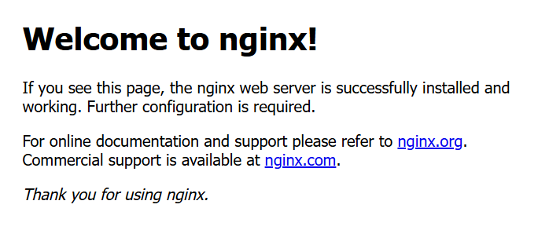

Ansible EC2 Setup – Install Nginx on Agent Node

This project demonstrates how to configure an Ansible master node (control node) on an EC2 Ubuntu instance, connect an agent node (managed node), and install Nginx using an Ansible playbook.

🚀 Steps
1. Setup EC2 Instances

Launch two EC2 Ubuntu instances on AWS:

Master Node → where Ansible is installed
Agent Node → where Nginx will be installed

2. Install Ansible on Master Node
sudo apt update -y
sudo apt install ansible -y

3. Configure SSH Access (Passwordless Authentication)
On Master Node:
ssh-keygen -t ed25519 -C "ansible-key"
ssh-copy-id ubuntu@<AGENT_NODE_PRIVATE_IP>

Now, test:
ssh ubuntu@<AGENT_NODE_PRIVATE_IP>

4. Configure Ansible Inventory
Create inventory file:
[webservers]
<AGENT_NODE_PRIVATE_IP> ansible_user=ubuntu

5. Test Connection
ansible -i inventory all -m ping

Expected output: "ping": "pong"

6. Create Playbook to Install Nginx
Create file: install_nginx.yml

7. Run Playbook
ansible-playbook -i inventory install_nginx.yml

8. Verify in Browser

Copy Agent Node Public IP from AWS EC2 console.

Open in browser:
http://<AGENT_NODE_PUBLIC_IP>

You should see the default Nginx welcome page 🎉

📂 Project Structure

ansible-ec2-nginx/
├── inventory
├── install_nginx.yml
└── README.md

✅ Result

Master node controls the agent node via Ansible.

Nginx successfully installed on the agent node.

Web page accessible using agent’s public IP.